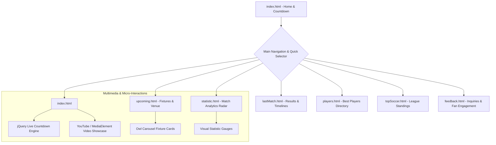

<div align="center">

# ⚽ SoccerVerse Competition Portal
### Next-Gen Sports Information, Live Match Center & Club World Cup Radar

[](#-overview)
[](#-tech-stack--libraries)
[](#-tech-stack--libraries)
[](#-tech-stack--libraries)
[](#-interactive-features--visual-engineering)
[](#-interactive-features--visual-engineering)
[](LICENSE)

**English** | [العربية](#-نظرة-عامة-باللغة-العربية)

</div>

---

## 🌟 Overview

**SoccerVerse** is a responsive soccer portal and match intelligence platform engineered for the **Aptech Web Development Competition**. The necessity for a centralized soccer hub arises from the global passion for the game, requiring fans, analysts, and casual followers to access comprehensive match scores, tournament schedules, transfer news, and player statistics from a single, beautifully designed interface.

Built with clean semantic HTML5, modular SCSS architectures, and high-performance jQuery/JavaScript animation libraries, SoccerVerse delivers an immersive, stadium-grade digital experience across desktop, tablet, and mobile devices.

---

## 🗺️ Information Architecture & Navigation Map

The portal is structured across seven specialized pages delivering real-time tournament tracking, player profiles, and statistical intelligence:



---

## 📄 Page Catalog & Core Modules

### 1. 🏠 Landing & Tournament Center (`index.html`)
- **Hero Stadium Banner**: High-definition overlay banner with typography and direct call-to-action triggers ("Book Ticket" and "Learn More").
- **Live Countdown Sentinel**: Real-time JavaScript countdown (`jquery.countdown.min.js`) ticking down weeks, days, hours, and seconds to the FIFA Club World Cup.
- **Trending Fixtures & News Feed**: Carousel showing breaking transfer rumors, injury reports, and match predictions.
- **Embedded Match Action**: Floating video modal support for match highlights and post-game interviews.

### 2. 📅 Upcoming Matches & Fixtures (`upcoming.html`)
- **Comprehensive Fixture Schedule**: Matchday chronologies with official team emblems, home vs. away classifications, and kick-off times.
- **Stadium & Venue Intelligence**: Stadium details, seating capacities, weather conditions, and ticket booking links.

### 3. ⏱️ Match Results & Timelines (`lastMatch.html`)
- **Historical Match Archive**: Final scoreboards for concluded international and domestic league fixtures.
- **Chronological Match Timelines**: Goal milestones, penalty conversions, yellow/red disciplinary cards, and tactical substitutions.

### 4. 🌟 World-Class Player Directory (`players.html`)
- **Player Showcase Grid**: Dedicated profile cards for world superstars (Messi, Cristiano Ronaldo, Erling Haaland, Kylian Mbappé, etc.).
- **Player Attributes**: Key metrics including squad numbers, primary playing positions, national team representations, market values, and seasonal goal/assist tallies.

### 5. 🏆 Top Soccer Leagues & Tournaments (`topSoccer.html`)
- **Global League Tables**: Standings and leaderboards across UEFA Champions League, English Premier League, Spanish La Liga, Italian Serie A, and German Bundesliga.
- **Form Guides & Qualification Zones**: Visual markers for Champions League, Europa League, and relegation zones.

### 6. 📊 In-Depth Match Analytics (`statistic.html`)
- **Head-to-Head Comparisons**: Team metric breakdowns covering possession percentages, total shots, shots on target, pass accuracy rates, offsides, and corners.
- **Disciplinary Breakdown**: Aggregated foul counts and card distributions.

### 7. 💬 Fan Feedback & Community Portal (`feedback.html`)
- **Engagement Form**: Validated feedback form for community reviews, ticket inquiries, and website suggestions.
- **Contact Channels**: Interactive social handles and direct response validation.

---

## 🎨 Interactive Features & Visual Engineering

- **✨ Scroll-Triggered Micro-Animations (AOS)**: Fluid viewport-based element reveals (`data-aos="fade-up"`, `zoom-in`) delivering a modern native-app feel.
- **🎠 Adaptive Multi-Touch Carousels**:
  - **Owl Carousel 2** and **Slick Carousel** configured for smooth touch swipe gestures on mobile and auto-sliding carousels on desktop.
- **⏱️ Precision Client Countdown Engine**:
  - Dynamic timestamp difference calculations with automated zero-padding.
- **🎥 Multimedia Video Overlay**:
  - Cross-browser video rendering powered by **MediaElement.js** and **jquery.mb.YTPlayer** for background video stadium atmospheres.
- **🖼️ Lightbox Image Galleries**:
  - Modal image previews via **Fancybox 3** and **Magnific Popup** for high-resolution stadium photography.
- **📱 Fully Responsive Mobile Navigation**:
  - Off-canvas slide-out hamburger navigation menu with smooth touch toggle.

---

## 🛠️ Tech Stack & Libraries

| Category | Technology | Usage & Specification |
|---|---|---|
| **Structure** | HTML5 Semantic Markup | Accessible, SEO-structured documents with OpenGraph meta |
| **Styling** | SCSS / CSS3 | Modular SCSS (`_site-base`, `_site-blocks`, `_site-navbar`) |
| **Preprocessor** | Prepros 6 | Auto-prefixing, minification, and SCSS compilation |
| **Grid Framework** | Bootstrap 4.x | Flexbox 12-column responsive layout engine |
| **Core Scripting** | JavaScript ES6+ / jQuery 3.3.1 | DOM manipulation, dynamic events, and widget binding |
| **Carousels** | Owl Carousel 2 & Slick.js | Multi-item match sliders and news carousels |
| **Animations** | AOS (Animate On Scroll) | Viewport intersection reveal animations |
| **Video Player** | MediaElement.js & YTPlayer | HTML5 media fallbacks and YouTube video integration |
| **Typography** | Google Fonts (Montserrat) | Modern, high-legibility geometric sans-serif |
| **Iconography** | Icomoon & Flaticon | Custom vector football icons and system glyphs |

---

## 📁 Project Directory Layout

```text
SoccerVerse_Competition/
├── css/                             # Compiled production stylesheets
│   ├── bootstrap/bootstrap.css
│   ├── aos.css
│   ├── owl.carousel.min.css
│   ├── jquery.fancybox.min.css
│   └── style.css                    # Main compiled theme stylesheet
├── scss/                            # Source Sass stylesheets
│   ├── bootstrap/                   # Bootstrap SCSS primitives
│   ├── _site-base.scss              # Global variables, typography & resets
│   ├── _site-blocks.scss            # Hero, match cards, player widgets
│   ├── _site-navbar.scss            # Fixed & off-canvas navigation styles
│   └── style.scss                   # Central Sass aggregation bundle
├── js/                              # Production JavaScript scripts
│   ├── jquery-3.3.1.min.js
│   ├── bootstrap.min.js
│   ├── owl.carousel.min.js
│   ├── aos.js
│   ├── jquery.countdown.min.js
│   ├── jquery.fancybox.min.js
│   ├── mediaelement-and-player.min.js
│   └── main.js                      # Custom UI logic & plugin initializers
├── fonts/                           # Vector web fonts & icon packs
│   ├── icomoon/
│   └── flaticon/
├── images/                          # HD match wallpapers, player avatars & logos
├── index.html                       # Homepage with countdown & highlights
├── upcoming.html                    # Fixtures & scheduled matches
├── lastMatch.html                   # Past results & score timelines
├── players.html                     # Best player profiles & valuations
├── topSoccer.html                   # Global league standings
├── statistic.html                   # Match analytics radar
├── feedback.html                    # Community feedback & contact
├── prepros-6.config                 # Prepros asset pipeline configuration
└── README.md
```

---

## 🚀 Local Development & Preview

Because SoccerVerse is built with native client-side web technologies, no heavy build server is required to preview the portal.

### Method 1: Python Built-In HTTP Server (Recommended)
```bash
# Clone the repository
git clone https://github.com/Brosfeer/SoccerVerse_Competition.git
cd SoccerVerse_Competition

# Start an instant local web server
python3 -m http.server 8080
```
Open [http://localhost:8080](http://localhost:8080) in your browser.

### Method 2: Node.js `serve` / `npx`
```bash
npx serve .
```

### Method 3: SCSS Live Compilation (Optional)
If you wish to modify the source SCSS files under `scss/`:
- Open the project directory in **Prepros 6**, or
- Use standard Sass CLI:
  ```bash
  sass scss/style.scss css/style.css --watch
  ```

---

## 🇸🇦 نظرة عامة باللغة العربية

بوابة **SoccerVerse** هي منصة ويب رياضية تفاعلية متكاملة تم تطويرها خصيصاً للمشاركة في **مسابقة Aptech لتصميم وتطوير مواقع الويب**. تهدف المنصة إلى تقديم مركز رياضي موحد وشامل لعشاق كرة القدم حول العالم، يجمع بين مواعيد المباريات، النتائج المباشرة، إحصائيات اللاعبين، وجداول الدوريات الكبرى.

### أبرز ميزات المنصة:
1. **العد التنازلي المباشر للبطولات الكبرى**: عدّاد زمني تفاعلي (`jQuery Countdown`) يحسب الأسابيع والأيام المتبقية لانطلاق بطولة كأس العالم للأندية.
2. **مركز المباريات والنتائج (Match Center)**:
   - صفحة المباريات القادمة (`upcoming.html`) مع بيانات الملاعب وأوقات الانطلاق.
   - صفحة أرشيف النتائج الأخيرة (`lastMatch.html`) مع الخطوط الزمنية للأهداف والبطاقات.
3. **دليل نجوم العالم (`players.html`)**: بطاقات تعريفية مفصلة لأبرز لاعبي كرة القدم العالميين مع مراكز لعبهم وقيمهم السوقية.
4. **جداول الدوريات العالمية (`topSoccer.html`)**: ترتيب أندية دوري أبطال أوروبا، الدوري الإنجليزي، والدوري الإسباني مع مؤشرات التأهل والهبوط.
5. **رادار التحليلات الإحصائية (`statistic.html`)**: مقارنات رقمية شاملة لنسب الاستحواذ، التسديدات، دقة التمرير، والأخطاء.
6. **معمارية SCSS وتصميم متجاوب 100%**: بني الموقع بالكامل وفق أحدث معايير الويب المتجاوب ليعمل بسلاسة فائقة على شاشات الجوال والحواسب اللوحية والمكتبية.

---

## 📄 License

Distributed under the **MIT License**. See [LICENSE](LICENSE) for details.

Crafted with engineering discipline for the **Aptech Web Competition**.
